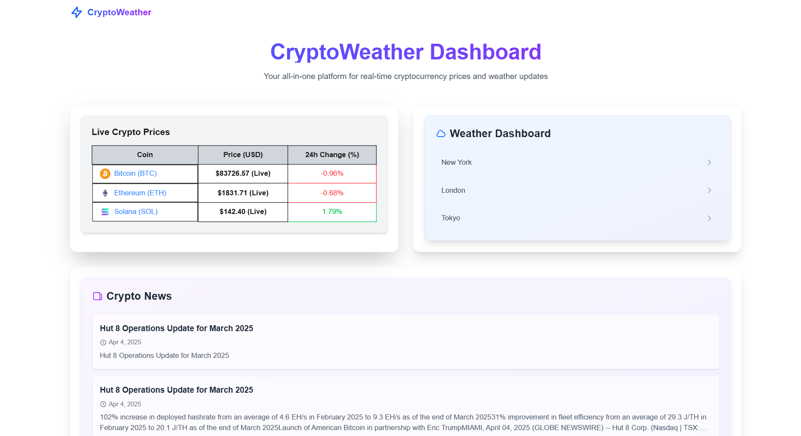

# 🌤️💸 CryptoWeather Nexus

**CryptoWeather Nexus** is a modern, responsive dashboard that fuses **real-time cryptocurrency data** with **weather information** for global cities. Get current conditions, price alerts, historical charts, and breaking crypto news — all in one place.

---

## 🖼️ Preview

---

## 🚀 Features

- 🔴 **Live BTC & ETH price updates** via WebSocket
- 🌤️ **Current weather & 5-day forecast** for New York, London, Tokyo
- 📈 **Weather history** with Chart.js and data table
- 📢 **Real-time alerts** for crypto price spikes or simulated weather events
- 📰 **Top 5 crypto news headlines** via NewsData.io
- 🏙️ **City detail pages** with charts, forecasts, and historical weather
- 🌐 **Responsive UI** with Tailwind CSS + animations
- ⚙️ Built using the latest **Next.js App Router architecture**

---

## 🛠️ Tech Stack

| Layer              | Technology                                    |
|-------------------|-----------------------------------------------|
| **Framework**      | [Next.js (App Router)](https://nextjs.org/)   |
| **Language**       | TypeScript                                     |
| **Styling**        | Tailwind CSS                                   |
| **State Management** | Redux Toolkit + React-Redux                  |
| **Data Fetching**  | Axios                                          |
| **Charts**         | Chart.js                                       |
| **WebSocket**      | CoinCap for crypto prices |
| **APIs**           | OpenWeatherMap, CoinCap, NewsData.io          |
| **Deployment**     | Vercel                                         |

---

